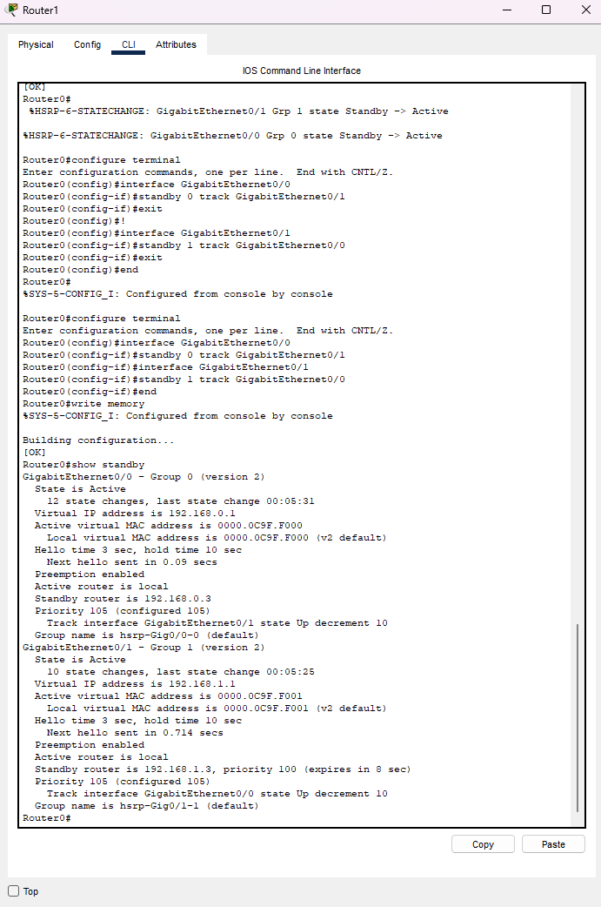
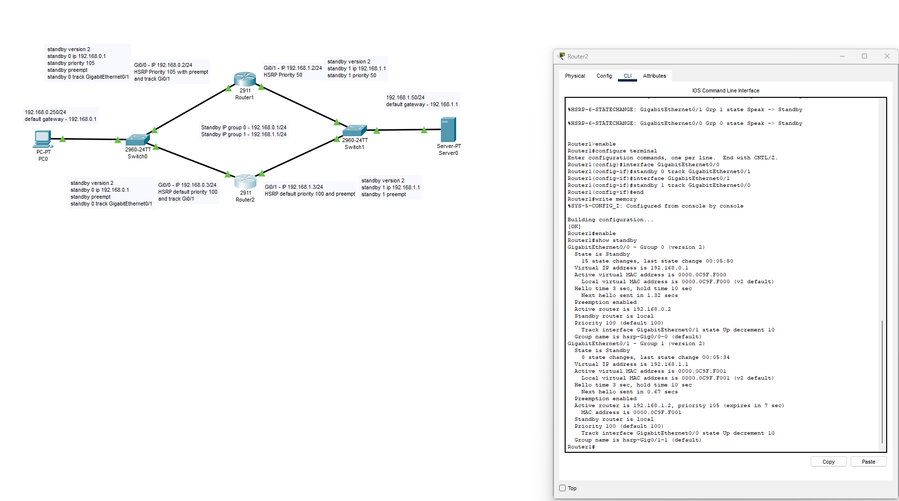
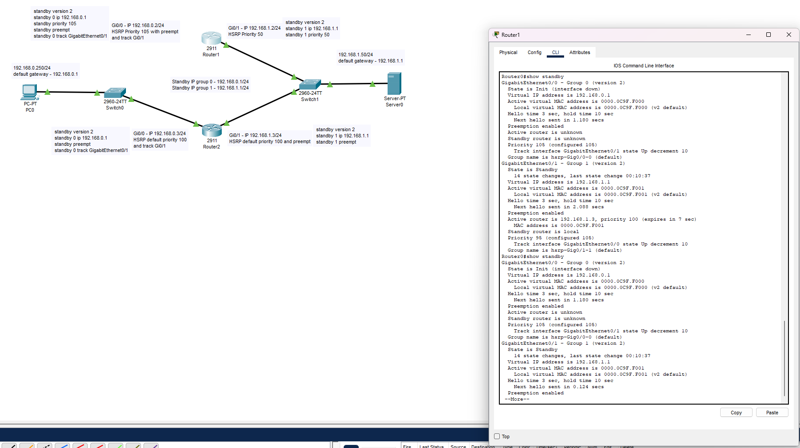
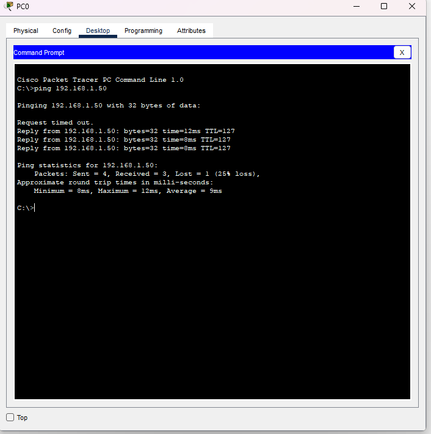
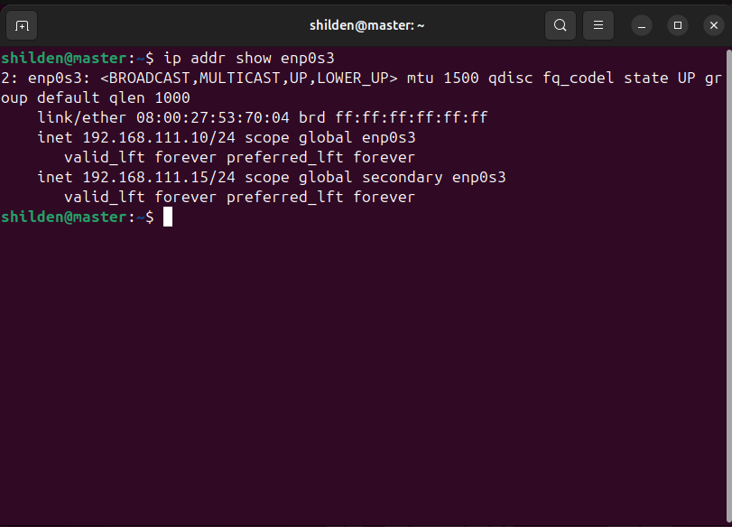
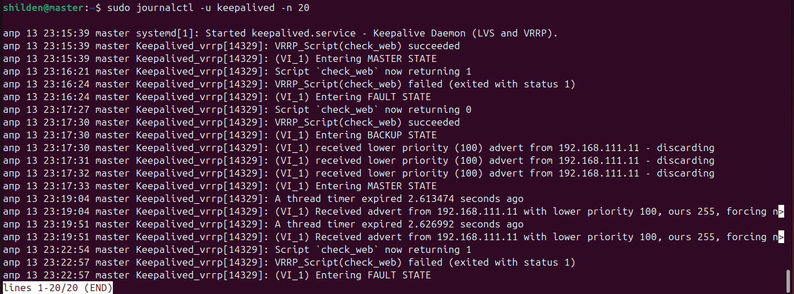
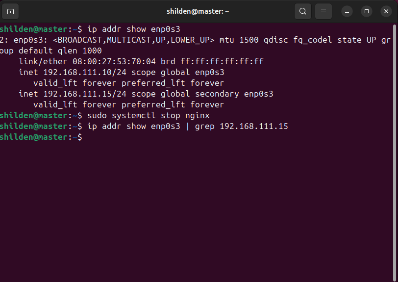
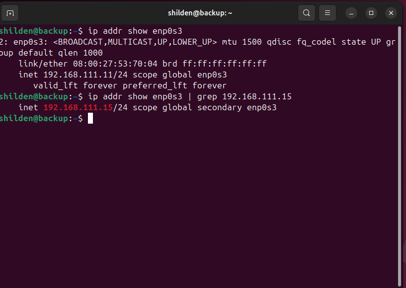

# Домашнее задание к занятию 1 «Disaster recovery и Keepalived» - Шилихин Денис

---

### Задание 1

**Настройка HSRP и отслеживания интерфейсов в Cisco Packet Tracer**

В рамках данного задания требовалось настроить отслеживание состояния интерфейса `Gi0/0` для первой группы HSRP на маршрутизаторах. Цель — обеспечить автоматическое переключение виртуального IP-адреса в случае падения линка.

**Выполнение:**

1. В Cisco Packet Tracer создана схема с двумя маршрутизаторами (Router0, Router1), двумя коммутаторами и двумя хостами (PC0, Server0).
2. Настроены IP-адреса интерфейсов:
   - `Router0`: G0/0 `192.168.0.2/24`, G0/1 `192.168.1.2/24`
   - `Router1`: G0/0 `192.168.0.3/24`, G0/1 `192.168.1.3/24`
3. Настроен HSRP (группа 0 для сети `192.168.0.0/24`, группа 1 для сети `192.168.1.0/24`):
   - **Router0 (Master)**: Приоритет 105, включен `preempt`.
   - **Router1 (Backup)**: Приоритет 100.
4. Добавлено отслеживание интерфейса `Gi0/0` для группы 1 с помощью команды `standby 1 track GigabitEthernet0/0`.
5. Выполнена проверка: при разрыве кабеля между `Router0` и `Switch0` приоритет `Router0` для группы 1 снизился, и виртуальный IP перешел на `Router1`.

**Результат настройки HSRP и трекинга:**

```bash
Router0#show standby
GigabitEthernet0/0 - Group 0 (version 2)
  State is Active
  Virtual IP address is 192.168.0.1
  Priority 105 (configured 105)
  Track interface GigabitEthernet0/1 state Up decrement 10
GigabitEthernet0/1 - Group 1 (version 2)
  State is Active
  Virtual IP address is 192.168.1.1
  Priority 105 (configured 105)
  Track interface GigabitEthernet0/0 state Up decrement 10
```

**Скриншоты проверки работоспособности:**

*   Конфигурация HSRP и трекинга на Router0 (Master):
    

*   Конфигурация на Router1 (Backup):
    

*   Результат `show standby` после обрыва кабеля (приоритет снизился до 95):
    

*   Проверка доступности сервера с PC0 после переключения (ping успешен):
    


---

Задание 2
Настройка Keepalived с отслеживанием веб-сервера

Целью задания являлась установка и настройка сервиса Keepalived на двух виртуальных машинах Linux с организацией отслеживания состояния веб-сервера (nginx) и автоматическим переносом виртуального IP-адреса при сбое.

Выполнение:

На двух виртуальных машинах (Ubuntu 24.04) установлены пакеты keepalived, nginx, netcat-openbsd.

В качестве веб-сервера использовался nginx. На каждой ВМ создана простая index.html для идентификации.

Написан Bash-скрипт check_web.sh, который проверяет доступность порта 80 и наличие файла index.html.

Создана конфигурация Keepalived, использующая vrrp_script для выполнения скрипта проверки каждые 3 секунды.

Настроен VRRP-кластер:

Мастер (master): приоритет 255, состояние MASTER.

Бэкап (backup): приоритет 100, состояние BACKUP.

Проведено тестирование: при остановке nginx на мастере виртуальный IP успешно переключался на бэкап, а при восстановлении — возвращался обратно.

Код скрипта проверки веб-сервера (/usr/local/bin/check_web.sh):

```
#!/bin/bash

WEB_PORT=80
WEB_ROOT="/var/www/html"
INDEX_FILE="index.html"

if ! nc -z localhost $WEB_PORT 2>/dev/null; then
    exit 1
fi

if [ ! -f "$WEB_ROOT/$INDEX_FILE" ]; then
    exit 1
fi

exit 0
```

Конфигурационный файл Keepalived для мастера (/etc/keepalived/keepalived.conf):
```
vrrp_script check_web {
    script "/usr/local/bin/check_web.sh"
    interval 3
    fall 2
    rise 2
}

vrrp_instance VI_1 {
    state MASTER
    interface enp0s3
    virtual_router_id 15
    priority 255
    advert_int 1

    virtual_ipaddress {
        192.168.111.15/24
    }

    track_script {
        check_web
    }
}
```

**Скриншоты проверки работоспособности:**

*   Виртуальный IP на мастере до сбоя:
    

*   Лог Keepalived на мастере при падении nginx:
    

*   Виртуальный IP на мастере после остановки nginx (пропал):
    

*   Виртуальный IP на бэкапе после сбоя мастера (появился):
    
